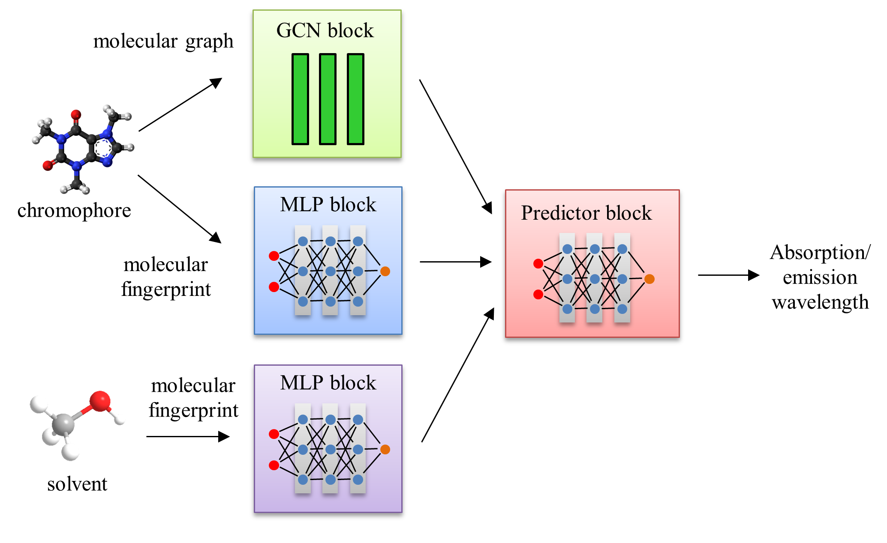

This repository contains the code implementations for the paper [Enhanced Prediction of Absorption and Emission Wavelengths of Organic Compounds through Hybrid Graph Neural Network Architectures](https://doi.org/10.26434/chemrxiv-2025-rcwxh)



## Installation

- Clone this repo: Open terminal

```
git clone https://github.com/phatdatnguyen/hybrid-GNN-optical-property-prediction
```

- Create and activate virtual environment:

```
cd gnn-webui
python -m venv gnn-env
gnn-env\Scripts\activate
```

- Install packages:

Install [PyTorch](https://pytorch.org/)

```

pip3 install torch --index-url https://download.pytorch.org/whl/cu128

```

Install [PyTorch-Geometric](https://pytorch-geometric.readthedocs.io/en/latest/install/installation.html)

```
pip install torch_geometric
pip install pyg_lib torch_scatter torch_sparse torch_cluster torch_spline_conv -f https://data.pyg.org/whl/torch-2.7.0+cu128.html

```

Install other packages

```
pip install rdkit
pip install mordred
pip install deepchem
pip install tabulate
```

## Data Processing, Training and Evaluation
Activate the virtual environment and start by using the ipython notebooks
- For models without solvent features: `ABS_EMS_prediction`
- For models with solvent features: `ABS_EMS_prediction_with_solvent`
- For classifying chromophores: `Classify_chromophores`